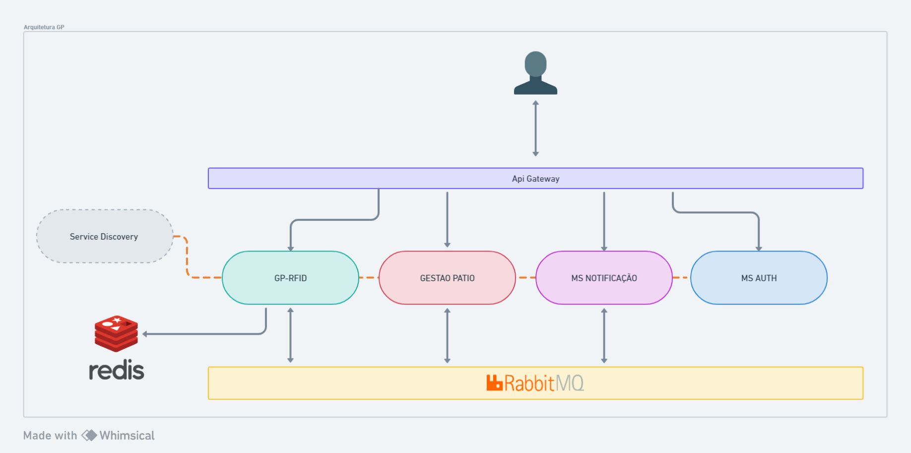

# Sistema para gerenciamento de antenas RFID Acura

Este sistema contém as seguintes funcionalidades:

- Gerenciamento de antenas:

  - conecta com as antenas listadas no banco ao iniciar o sistema e gerencia seus estados no Redis a partir do listener de erros da antena
  - rota para listagem de antenas / status
  - rotas para conexão / reconexão ou desconexão de uma antena

- Gerenciamento de Tags:
  - Leitura de tags (envia eventos de leitura para o sistema gestao-patios, que trata a tag lida)
  - Escrever tag
  - Ler tag

**A documentação do Swagger contendo as rotas da API podem ser acessadas pelo link: **
https://{{gp-rfid_endpoint}}/rfid/swagger-ui/index.html
